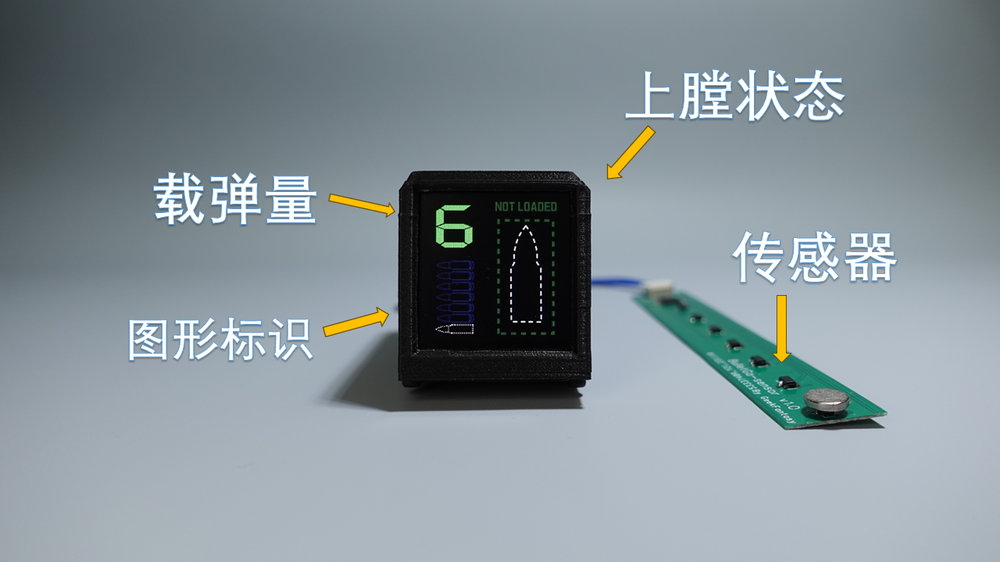
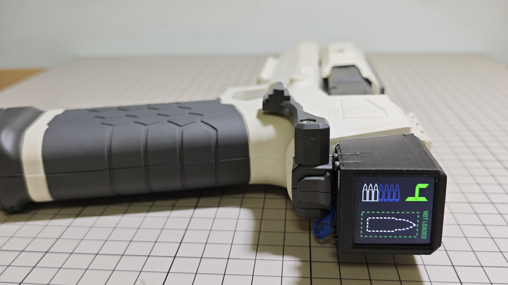
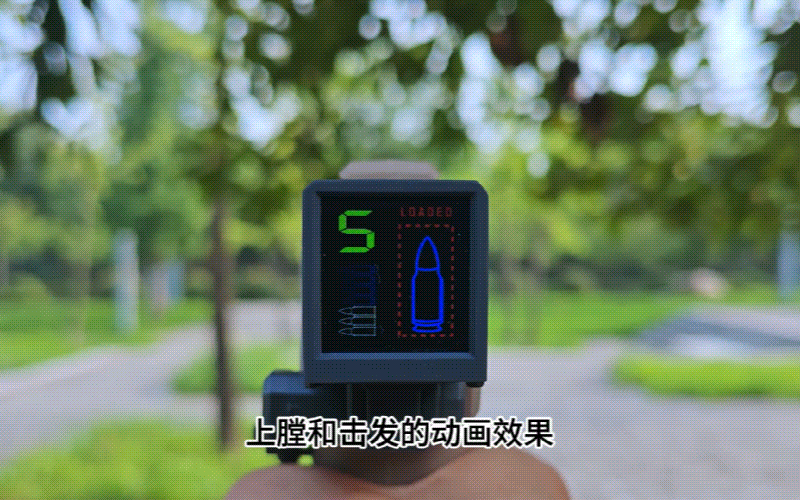
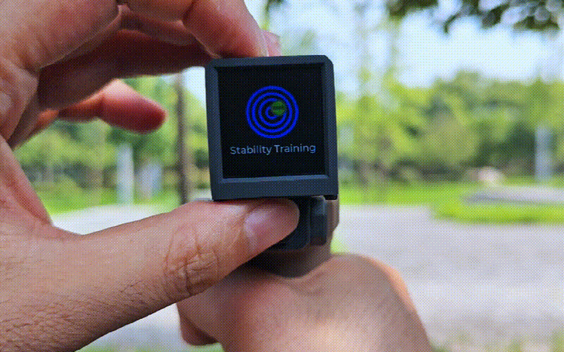

## 项目说明：
此项目的是主要目的是智能化升级一款软蛋(海绵软蛋)发射器（森柏龙壁虎2.0）。 在发射器上安装了一套以ESP32-Pico-D4为主控的设备，配置1.33英寸TFT屏幕，集成IMU:MPU6050 和 8个霍尔传感器。IMU用来使用体感来与系统交互，霍尔传感器配合磁体，用于检测载弹量和上膛状态。使用ESP32集成的蓝牙和Wifi可与其他系统交互，完成数据上报。
项目代码机基于以下项目开发：
https://github.com/peng-zhihui/HoloCubic 
https://github.com/ClimbSnail/HoloCubic_AIO

### B站视频：
https://www.bilibili.com/video/BV1oKWseEEC7 

### 功能包含：
载弹量检测，上膛和击发检测，射击稳定性检测，持枪稳定性训练，运动状态监测 等。

### 应用切换

### 弹量显示

### 持枪稳定性训练

### 射击稳定性检测

